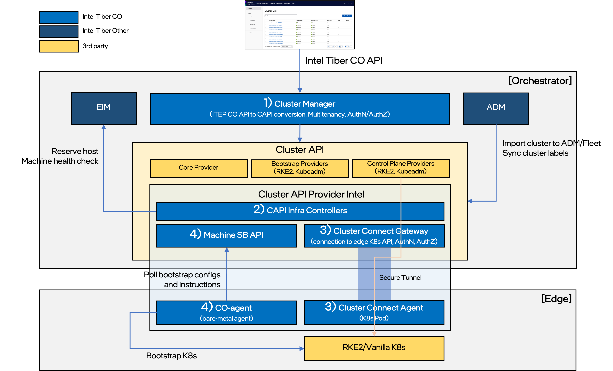
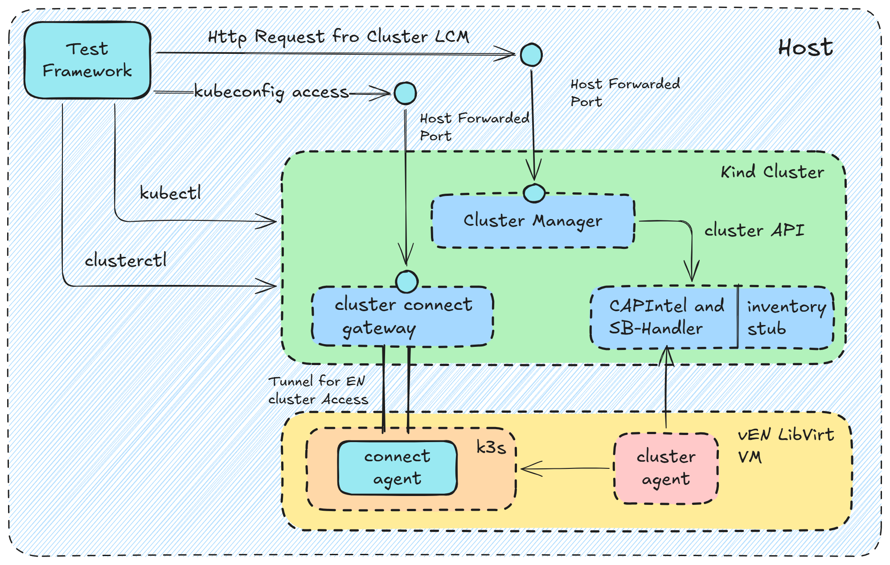

# Test Plan for Cluster Orchestration sub-system in Intel® Open Edge Platform

## 1. Introduction

### 1.1 Purpose

The purpose of the test plan document is to outline the testing strategy for the Cluster Orchestration (CO) sub-system in
Intel® Open Edge platform. The document also provides the scope, objectives, and approach for testing the CO.
The document also provides the list of test cases that will be executed to validate the CO.

### 1.2 Scope

The scope is primarily to validate the CO by mocking external dependencies as much as possible.
The CO is responsible for managing the life-cycle of the edge node cluster.
Below diagram represents the high-level design of the CO:


> **NB:** The diagram above may reference RKE2 or kubeadm as the workload cluster distribution. In the current
> test environment, **K3s** is used instead. All references to RKE2 or kubeadm in the diagram should be read as K3s.

The scope of the test plan is to validate the CO sub-system by executing the test cases defined in this document.
It is to be noted that other sub-systems may also get validated as part of the CO testing, but it is not the
primary objective of this document.

### 1.3 Objectives

The objectives of this document are as follows:

- To outline the testing approach for the CO.
- To define the test environment for testing the CO.
- To define the test criteria for testing the CO.
- To provide the list of test cases that will be executed to validate the CO.

## 2. Test Approach

The test approach for the CO is to validate the CO by mocking external dependencies as much as possible. Below diagram
represents the high-level test approach for the CO:


The E2E test environment is composed of the following logical layers running on a single **Host** machine:

### 2.1 Test Framework

The Test Framework runs directly on the Host and drives all test scenarios. It interacts with the CO sub-system through two channels:

- **HTTP requests for Cluster LCM** – REST API calls sent to the Cluster Manager via a host-forwarded port, used to create, query, update, and delete clusters and cluster templates.
- **Kubeconfig access** – Direct access to the Kind cluster's Kubernetes API server (via a host-forwarded port), using `kubectl` for resource inspection and `clusterctl` for retrieving the workload-cluster kubeconfig.

### 2.2 Kind Cluster (CO Control Plane)

A [Kind](https://kind.sigs.k8s.io/) cluster runs on the Host and hosts all CO control-plane components:

| Component | Description |
|---|---|
| **Cluster Manager** | Exposes the northbound REST API for cluster lifecycle management (LCM). |
| **CAPIntel and SB-Handler** | Cluster API (CAPI) provider for Intel edge nodes; handles southbound interactions with the edge node infrastructure. |
| **cluster connect gateway** | Provides secure tunnel-based access to the workload cluster's Kubernetes API from the Host. |
| **inventory stub** | A stub service that mocks the inventory system, removing the dependency on a real inventory back-end. |

The Cluster Manager, CAPIntel/SB-Handler, and the cluster connect gateway communicate internally via the Kubernetes API (cluster API).

### 2.3 Virtual Edge Node (vEN LibVirt VM)

A LibVirt-based virtual machine simulates a real edge node. The VM runs:

| Component | Description |
|---|---|
| **k3s** | A lightweight Kubernetes distribution acting as the workload cluster on the edge node. |
| **connect gateway agent** | Establishes and maintains the secure tunnel back to the cluster connect gateway running in the Kind cluster. |
| **cluster agent** | Manages the edge node cluster lifecycle and reports status to the CO control plane. |

The connect gateway agent and cluster agent inside the VM connect to the cluster connect gateway in the Kind cluster over a dedicated tunnel, enabling the Host (and the Test Framework) to reach the workload cluster's Kubernetes API.

### 2.4 Authentication (OIDC Mock)

The Cluster Manager enforces JWT-based authentication on its REST API. In a production deployment, tokens are issued by a real Keycloak instance at `platform-keycloak.orch-platform.svc`. In the test environment this dependency is replaced by a lightweight **OIDC mock**:

- **Key generation** – At test startup, an RSA-2048 key pair is generated once and persisted to `/tmp/cluster-tests-dynamic-keys.pem` so it can be reused across test runs without re-configuration.
- **OIDC discovery endpoint** – The `oidc_mock_gen` helper emits a Kubernetes manifest that deploys a minimal HTTP service inside the Kind cluster. The service exposes the standard OIDC discovery (`/.well-known/openid-configuration`) and JWKS (`/jwks`) endpoints, advertising the same public key used to sign test tokens. This allows the Cluster Manager to validate tokens without a real Keycloak.
- **Token minting** – The test framework mints short-lived JWT tokens signed with the generated RSA private key. Each token carries the issuer (`http://platform-keycloak.orch-platform.svc/realms/master`), audience (`cluster-manager`), and subject (`test-user`) that the Cluster Manager expects.
- **Opt-out** – Setting the environment variable `DISABLE_AUTH=true` skips JWT setup and sends unauthenticated requests, which is useful for local development against a Cluster Manager instance that has authentication disabled.

## 3. Test Environment

The test environment will use a system that is similar to `t3.xlarge` (or better) in configuration, i.e., 4vCPUs, 16 GiB
memory and at least 50GiB of storage with Ubuntu 24.04 LTS OS to run the tests. The required tools and their versions
for the test will be managed by `asdf`.

Key infrastructure components provisioned on the Host:

- **Kind** – Creates the local Kubernetes cluster that hosts the CO control-plane components.
- **LibVirt / QEMU** – Provides the virtualisation layer for the vEN LibVirt VM that simulates the edge node.
- **kubectl / clusterctl** – CLI tools used by the Test Framework to interact with the Kind cluster and to retrieve workload-cluster kubeconfigs.
- **Port-forwarding** – Host-level port forwarding exposes the Cluster Manager REST API and the cluster connect gateway to the Test Framework.

To verify that all required tools and dependencies are correctly installed before running the tests, execute:

```bash
make preflight
```

## 4. Test Categories

At a very high level, the tests can be classified as Functional and Non-Functional. These categories of tests are further
classified into test types.

The functional tests can be

- Component level - COMP (Edge Cluster Manager, Intel Cluster Provider, ECM SB Handler etc)
- Integration - INT (Eg: CO Subsystem)
- System level - SYS (Eg: Test all of Intel® Open Edge Platform)

Non-functional tests can be

- Scalability (SCB)
- Stress (STR)
- Stability (STB)
- Chaos (CHAOS)
- Performance (PERF)
- High Availability (HA)
- Security (SEC)
- etc.

The initial goal of the test plan and execution will be focussed on Functional Integration tests to start with. However,
the framework itself shall be extensible to include other types of tests in the future.

## 5. Test Cases

### 5.1 Test Case Format

Test Case format shall look like below:

1. Test Case ID: A unique identifier for the test case. This can be a combination of the test category and a sequential
   number suffixed to `TC-CO-`. Ex: `TC-CO-INT-001`
1. Test Case Name: A brief, descriptive name for the test case.
1. Objective: The purpose of the test case.
1. Preconditions: Any conditions that must be met before the test can be executed.
1. Test Steps: A detailed, step-by-step description of the actions to be performed.
1. Test Data: Specific data to be used in the test.
1. Expected Result: The expected outcome of the test.

### 5.2 Implementation Status Summary

| Test Case ID | Description | Status | Source File |
|---|---|---|---|
| TC-CO-INT-001 | Cluster creation and deletion | Partial | `tests/cluster-api-test/cluster_api_test.go` |
| TC-CO-INT-002 | Import K3s cluster template | Implemented | `tests/template-api-test/template_api_test.go` |
| TC-CO-INT-003 | Cluster create API succeeds | Partial | `tests/cluster-api-test/cluster_api_test.go` |
| TC-CO-INT-004 | Cluster is fully active | Implemented | `tests/cluster-api-test/cluster_api_test.go` |
| TC-CO-INT-005 | Query cluster information | Partial | helper exists in `tests/utils/cluster_utils.go`, no `It` block |
| TC-CO-INT-006 | Query cluster label | Not implemented | — |
| TC-CO-INT-007 | Update cluster label | Not implemented | — |
| TC-CO-INT-008 | Connect gateway K8s API access | Implemented | `tests/cluster-api-test/cluster_api_test.go` |
| TC-CO-INT-009 | Cannot delete template in use | Implemented | `tests/cluster-api-test/cluster_api_test.go` |
| TC-CO-INT-010 | Retrieve a cluster template | Implemented | `tests/template-api-test/template_api_test.go` |
| TC-CO-INT-011 | No default template when none set | Implemented | `tests/template-api-test/template_api_test.go` |
| TC-CO-INT-012 | Set default cluster template | Implemented | `tests/template-api-test/template_api_test.go` |
| TC-CO-INT-013 | Set default template with invalid name errors | Implemented | `tests/template-api-test/template_api_test.go` |
| TC-CO-INT-014 | Filter templates by version | Implemented | `tests/template-api-test/template_api_test.go` |
| TC-CO-INT-015 | Retrieve kubeconfig from Cluster Manager REST API | Implemented (when `DISABLE_AUTH=false`) | `tests/cluster-api-test/cluster_api_test.go` |

### 5.3 List of Test Cases

### Test Case ID: TC-CO-INT-001

- **Test Description:** Verify Single Node K3s Cluster creation and deletion using Cluster Manager APIs
- **Implementation Status:** Partial — cluster creation and deletion steps are exercised inside `BeforeEach` / `AfterEach` of the `cluster_api_test.go` `Describe` suite but are not a dedicated standalone `It` block. The preconditions (namespace, port-forward, template import, cluster create) and teardown (delete + verify) are shared setup/teardown for TC-CO-INT-004 and TC-CO-INT-009.
- **Preconditions:**
  - Ensure the namespace exists or create it if it does not.
  - Port forward to the cluster manager service.
  - Import the cluster template and ensure it is ready.
- **Test Steps:**
  1. Authenticate with JWT and obtain a token with the right roles and permissions to access the ECM `/v1/clusters` POST API (skipped when `DISABLE_AUTH=true`).
  1. Send a POST request to create a new cluster using the available ClusterTemplate.
  1. Verify the Cluster CR is created in the Kubernetes API server.
  1. Verify the associated resources (KThreesControlPlane, IntelCluster, etc.) are created.
  1. Check the status of the Cluster CR to ensure it is marked as ready.
  1. Verify that the machine infrastructure is ready after successful cluster creation.
  1. Delete the cluster if `SKIP_DELETE_CLUSTER` is not set to `true`.
  1. Verify that the cluster is deleted.
- **Expected Results:**
  - The Cluster CR is created successfully.
  - Associated resources are created and linked correctly.
  - The Cluster CR status is marked as ready.
  - The machine infrastructure is ready.
  - The cluster is deleted successfully if `SKIP_DELETE_CLUSTER` is not set to `true`.

### Test Case ID: TC-CO-INT-002

- **Test Description:** Should successfully import K3s Single Node cluster template
- **Implementation Status:**Implemented — `tests/template-api-test/template_api_test.go` → `"should validate the template import success"`
- **Preconditions:**
  - Ensure the namespace exists or create it if it does not.
  - Port forward to the cluster manager service.
- **Test Steps:**
  1. Import the cluster template.
  1. Wait for the cluster template to be ready.
- **Expected Results:**
  - The cluster template is imported successfully.
  - The cluster template is marked as ready.

### Test Case ID: TC-CO-INT-003

- **Test Description:** Should verify that cluster create API should succeed
- **Implementation Status:** Partial — cluster creation is exercised inside `BeforeEach` of `cluster_api_test.go` (shared setup for TC-CO-INT-004 and TC-CO-INT-009) but there is no dedicated standalone `It` block that asserts only on the create response.
- **Preconditions:**
  - Ensure the namespace exists or create it if it does not.
  - Port forward to the cluster manager service.
  - Import the cluster template and ensure it is ready.
- **Test Steps:**
  1. Record the start time before creating the cluster.
  1. Send a POST request to create a new cluster using the available ClusterTemplate.
- **Expected Results:**
  - The cluster is created successfully.

### Test Case ID: TC-CO-INT-004

- **Test Description:** Should verify that the cluster is fully active
- **Implementation Status:** Implemented — `tests/cluster-api-test/cluster_api_test.go` → `"should verify that the cluster is fully active"`. Also validates connect-agent metrics and, when `DISABLE_AUTH=false`, the full JWT kubeconfig workflow.
- **Preconditions:**
  - Ensure the namespace exists or create it if it does not.
  - Port forward to the cluster manager service.
  - Import the cluster template and ensure it is ready.
  - Create the cluster.
- **Test Steps:**
  1. Wait for IntelMachine to exist.
  1. Wait for all components to be ready (via `clusterctl describe`).
  1. Verify connect-agent metrics report a successful connection.
  1. Retrieve kubeconfig and validate downstream cluster access (see TC-CO-INT-008).
  1. If authentication is enabled, validate the full JWT → kubeconfig → downstream access workflow (see TC-CO-INT-015).
- **Expected Results:**
  - IntelMachine exists.
  - All components are ready.
  - Connect-agent metrics confirm a successful tunnel connection.
  - Downstream cluster is accessible via the connect gateway.

### Test Case ID: TC-CO-INT-005

- **Test Description:** Should verify that the cluster information can be queried
- **Implementation Status:** Partial — `GetClusterInfo` and `GetClusterInfoWithAuth` helper functions exist in `tests/utils/cluster_utils.go` but are not called from any `It` block. No standalone test exercises this endpoint.
- **Preconditions:**
  - Ensure the namespace exists or create it if it does not.
  - Port forward to the cluster manager service.
  - Import the cluster template and ensure it is ready.
  - Create the cluster.
- **Test Steps:**
  1. Send a GET request to retrieve the cluster information.
- **Expected Results:**
  - The HTTP response status code is 200 (OK).
  - The cluster information is retrieved successfully.

### Test Case ID: TC-CO-INT-006

- **Test Description:** Should verify that the cluster label can be queried
- **Implementation Status:** Not implemented — no label-query helper function or `It` block exists.
- **Preconditions:**
  - Ensure the namespace exists or create it if it does not.
  - Port forward to the cluster manager service.
  - Import the cluster template and ensure it is ready.
  - Create the cluster.
- **Test Steps:**
  1. Send a GET request to retrieve the cluster label.
- **Expected Results:**
  - The cluster label is retrieved successfully.

### Test Case ID: TC-CO-INT-007

- **Test Description:** Should verify that the cluster label can be updated
- **Implementation Status:** Not implemented — no label-update helper function or `It` block exists.
- **Preconditions:**
  - Ensure the namespace exists or create it if it does not.
  - Port forward to the cluster manager service.
  - Import the cluster template and ensure it is ready.
  - Create the cluster.
- **Test Steps:**
  1. Send a PUT request to update the cluster label.
- **Expected Results:**
  - The cluster label is updated successfully.

### Test Case ID: TC-CO-INT-008

- **Test Description:** Should verify that the connect gateway allows access to the k8s API
- **Implementation Status:** Implemented — covered inside the `"should verify that the cluster is fully active"` `It` block via `validateKubeconfigAndClusterAccess()` in `tests/cluster-api-test/cluster_api_test.go`. Also validates that all pods are running and that `exec` works on a pod in the downstream cluster.
- **Preconditions:**
  - Port forward to the cluster gateway service.
- **Test Steps:**
  1. Get kubeconfig using `clusterctl`.
  1. Set the server in kubeconfig to the cluster connect gateway URL.
  1. Use kubeconfig to fetch the list of pods across all namespaces.
  1. Wait for all pods to reach `Running` or `Completed` state.
  1. Execute a command (`ls`) inside the `local-path-provisioner` pod to confirm `exec` works.
- **Expected Results:**
  - The pod list is retrieved successfully.
  - All pods reach a healthy state.
  - Remote command execution succeeds.

### Test Case ID: TC-CO-INT-009

- **Test Description:** Should verify that a cluster template cannot be deleted if there is a cluster using it.
- **Implementation Status:** Implemented — `tests/cluster-api-test/cluster_api_test.go` → `"should verify that a cluster template cannot be deleted if there is a cluster using it"`
- **Preconditions:**
  - Ensure the namespace exists or create it if it does not.
  - Port forward to the cluster manager service.
  - Import the cluster template and ensure it is ready.
  - Create a cluster using the imported cluster template.
- **Test Steps:**
  1. Attempt to delete the cluster template using the DELETE API.
- **Expected Results:**
  - The DELETE request fails with an error message indicating that the cluster template is in use.

### Test Case ID: TC-CO-INT-010

- **Test Description:** Should be able to retrieve a cluster template by name and version
- **Implementation Status:** Implemented — `tests/template-api-test/template_api_test.go` → `"Should be able to retrieve a template"`
- **Preconditions:**
  - Ensure the namespace exists or create it if it does not.
  - Port forward to the cluster manager service.
  - Import the K3s baseline cluster template.
- **Test Steps:**
  1. Send a GET request to retrieve the cluster template by name and version.
- **Expected Results:**
  - The template is returned and its `name-version` matches the imported K3s baseline template.

### Test Case ID: TC-CO-INT-011

- **Test Description:** Should not find a default template when none has been set
- **Implementation Status:** Implemented — `tests/template-api-test/template_api_test.go` → `"Should not find a default template when non has been set"`
- **Preconditions:**
  - Ensure the namespace exists or create it if it does not.
  - Port forward to the cluster manager service.
  - No default template has been configured.
- **Test Steps:**
  1. Send a GET request to retrieve the default template.
- **Expected Results:**
  - The response indicates no default template is set (nil result, no error).

### Test Case ID: TC-CO-INT-012

- **Test Description:** Should be able to set a default cluster template
- **Implementation Status:** Implemented — `tests/template-api-test/template_api_test.go` → `"Should be able to set a default template"`
- **Preconditions:**
  - Ensure the namespace exists or create it if it does not.
  - Port forward to the cluster manager service.
  - Import the K3s baseline cluster template.
- **Test Steps:**
  1. Set the default template by providing only the template name (no version).
  1. Retrieve the default template and verify name and version match.
  1. Set the default template again providing both name and version.
- **Expected Results:**
  - The default template is set successfully in both cases.
  - The retrieved default template name and version match what was set.

### Test Case ID: TC-CO-INT-013

- **Test Description:** Should error out when setting a default template with an invalid name
- **Implementation Status:** Implemented — `tests/template-api-test/template_api_test.go` → `"Should error out when setting a default template with an invalid name"`
- **Preconditions:**
  - Ensure the namespace exists or create it if it does not.
  - Port forward to the cluster manager service.
- **Test Steps:**
  1. Attempt to set the default template to a non-existing template name and version.
- **Expected Results:**
  - The API returns an error.

### Test Case ID: TC-CO-INT-014

- **Test Description:** Should return only templates matching a version filter
- **Implementation Status:** Implemented — `tests/template-api-test/template_api_test.go` → `"Should return templates matching a filter"`
- **Preconditions:**
  - Ensure the namespace exists or create it if it does not.
  - Port forward to the cluster manager service.
  - Import the K3s baseline cluster template.
- **Test Steps:**
  1. Send a GET request to list templates with a `version=<K3sTemplateVersion>` filter.
- **Expected Results:**
  - Exactly one template is returned, matching the K3s baseline template version.

### Test Case ID: TC-CO-INT-015

- **Test Description:** Should verify that the kubeconfig for a cluster can be retrieved from the Cluster Manager REST API using JWT authentication
- **Implementation Status:** Implemented — exercised inside the `"should verify that the cluster is fully active"` `It` block via `validateJWTWorkflow()` → `testKubeconfigRetrieval()` → `GetClusterKubeconfigFromAPI()` in `tests/cluster-api-test/cluster_api_test.go`. Runs when `DISABLE_AUTH=false`.
- **Preconditions:**
  - Ensure the namespace exists or create it if it does not.
  - Port forward to the cluster manager service.
  - Import the cluster template and ensure it is ready.
  - Create the cluster and wait for it to be fully active.
  - JWT authentication must be enabled (`DISABLE_AUTH` is not set to `true`).
- **Test Steps:**
  1. Mint a JWT token via the OIDC mock (see section 2.4).
  1. Send an authenticated `GET /v2/clusters/{clusterName}/kubeconfigs` request to the Cluster Manager REST API, passing the JWT as a Bearer token and the project namespace as the `Activeprojectid` header.
  1. Verify the HTTP response status is 200 (OK).
  1. Unmarshal the JSON response body and confirm the `kubeconfig` field is present and non-empty.
  1. Use the returned kubeconfig to connect directly to the downstream K3s cluster and perform a basic API call.
- **Expected Results:**
  - The Cluster Manager API accepts the JWT token and returns HTTP 200.
  - The response body contains a valid kubeconfig.
  - The downstream K3s cluster is reachable using the returned kubeconfig, confirming the end-to-end JWT → API → kubeconfig → cluster access workflow.
