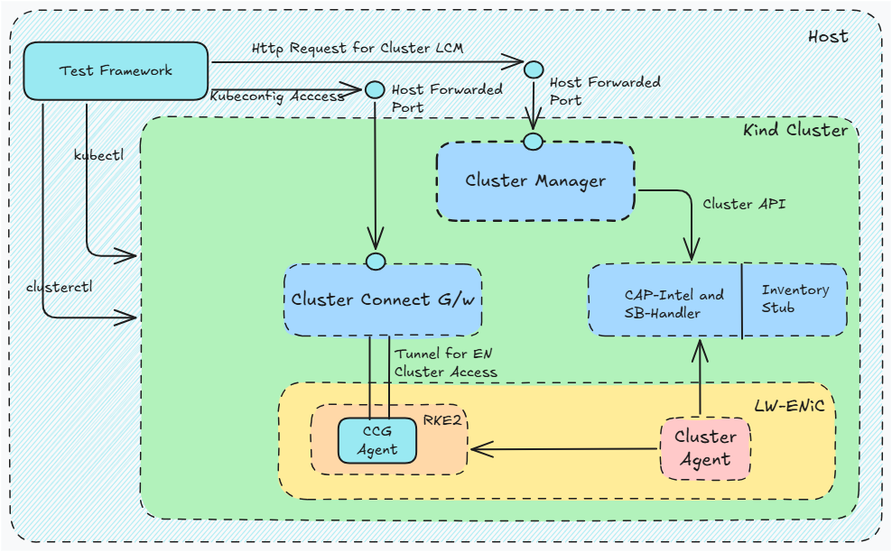

# Test Plan for Cluster Orchestration sub-system in Intel® Open Edge Platform

## 1. Introduction

### 1.1 Purpose

The purpose of the test plan document is to outline the testing strategy for the Cluster Orchestration (CO) sub-system in
Intel® Open Edge platform. The document also provides the scope, objectives, and approach for testing the CO.
The document also provides the list of test cases that will be executed to validate the CO.

### 1.2 Scope

The scope is primarily to validate the CO by mocking external dependencies as much as possible.
The CO is responsible for managing the life-cycle of the edge node cluster.
Below diagrams represents the high-level design of the CO:

The scope of the test plan is to validate the CO sub-system by executing the test cases defined in this document.
It is to be noted that other sub-systems may also get validated as part of the CO testing, but it is not the
primary objective of this document.

### 1.3 Objectives

The objectives of this document are as follows:

- To outline the testing approach for the CO.
- To define the test environment for testing the CO.
- To define the test criteria for testing the CO.
- To provide the list of test cases that will be executed to validate the CO.

## 2. Test Approach

The test approach for the CO is to validate the CO by mocking external dependencies as much as possible. Below diagram
represents the high-level test approach for the CO:

## 3. Test Environment

The test environment will use a system that is similar to `t3.xlarge` (or better) in configuration, i.e., 4vCPUs, 16 GiB
memory and at least 50GiB of storage with Ubuntu 22.04 LTS OS to run the tests. The required tools and their versions
for the test will be managed by `asdf`.

## 4. Test Catagories

At a very high level, the tests can be classified as Functional and Non-Functional. These categories of tests are further
classified into test types.

The functional tests can be

- Component level - COMP (Edge Cluster Manager, Intel Cluster Provider, ECM SB Handler etc)
- Integration - INT (Eg: CO Subsystem)
- System level - SYS (Eg: Test all of Intel® Open Edge Platform)

Non-functional tests can be

- Scalability (SCB)
- Stress (STR)
- Stability (STB)
- Chaos (CHAOS)
- Performance (PERF)
- High Availability (HA)
- Security (SEC)
- etc.

The initial goal of the test plan and execution will be focussed on Functional Integration tests to start with. However,
the framework itself shall be extensible to include other types of tests in the future.

## 5. Test Cases

### 5.1 Test Case Format

Test Case format shall look like below:

1. Test Case ID: A unique identifier for the test case. This can be a combination of the test category and a sequential
   number suffixed to `TC-CO-`. Ex: `TC-CO-INT-001`
1. Test Case Name: A brief, descriptive name for the test case.
1. Objective: The purpose of the test case.
1. Preconditions: Any conditions that must be met before the test can be executed.
1. Test Steps: A detailed, step-by-step description of the actions to be performed.
1. Test Data: Specific data to be used in the test.
1. Expected Result: The expected outcome of the test.

### 5.2 List of Test Cases

### Test Case ID: TC-CO-INT-001

- **Test Description:** Verify Single Node RKE2 Cluster creation and deletion using Cluster Manager APIs
- **Preconditions:**
  - Ensure the namespace exists or create it if it does not.
  - Port forward to the cluster manager service.
  - Import the cluster template and ensure it is ready.
- **Test Steps:**
  1. Authenticate with KeyCloak and obtain a token with the right roles and permissions to access the ECM /v1/clusters POST API.
  1. Send a POST request to create a new cluster using the available ClusterTemplate.
  1. Verify the Cluster CR is created in the Kubernetes API server.
  1. Verify the associated resources (RKE2ControlPlane, IntelCluster, etc.) are created.
  1. Check the status of the Cluster CR to ensure it is marked as ready.
  1. Verify that the machine infrastructure is ready after successful cluster creation.
  1. Delete the cluster if SKIP_DELETE_CLUSTER is not set to true.
  1. Verify that the cluster is deleted.
- **Expected Results:**
  - The Cluster CR is created successfully.
  - Associated resources are created and linked correctly.
  - The Cluster CR status is marked as ready.
  - The machine infrastructure is ready.
  - The cluster is deleted successfully if SKIP_DELETE_CLUSTER is not set to true.

### Test Case ID: TC-CO-INT-002

- **Test Description:** Should successfully import RKE2 Single Node cluster template
- **Preconditions:**
  - Ensure the namespace exists or create it if it does not.
  - Port forward to the cluster manager service.
- **Test Steps:**
  1. Import the cluster template.
  1. Wait for the cluster template to be ready.
- **Expected Results:**
  - The cluster template is imported successfully.
  - The cluster template is marked as ready.

### Test Case ID: TC-CO-INT-003

- **Test Description:** Should verify that cluster create API should succeed
- **Preconditions:**
  - Ensure the namespace exists or create it if it does not.
  - Port forward to the cluster manager service.
  - Import the cluster template and ensure it is ready.
- **Test Steps:**
  1. Record the start time before creating the cluster.
  1Send a POST request to create a new cluster using the available ClusterTemplate.
- **Expected Results:**
  - The cluster is created successfully.

### Test Case ID: TC-CO-INT-004

- **Test Description:** Should verify that the cluster is fully active
- **Preconditions:**
  - Ensure the namespace exists or create it if it does not.
  - Port forward to the cluster manager service.
  - Import the cluster template and ensure it is ready.
  - Create the cluster.
- **Test Steps:**
  1. Wait for IntelMachine to exist.
  1Wait for all components to be ready.
- **Expected Results:**
  - IntelMachine exists.
  - All components are ready.

### Test Case ID: TC-CO-INT-005

- **Test Description:** Should verify that the cluster information can be queried
- **Preconditions:**
  - Ensure the namespace exists or create it if it does not.
  - Port forward to the cluster manager service.
  - Import the cluster template and ensure it is ready.
  - Create the cluster.
- **Test Steps:**
  1. Send a GET request to retrieve the cluster information.
- **Expected Results:**
  - The HTTP response status code is 200 (OK).
  - The cluster information is retrieved successfully.

### Test Case ID: TC-CO-INT-006

- **Test Description:** Should verify that the cluster label can be queried
- **Preconditions:**
  - Ensure the namespace exists or create it if it does not.
  - Port forward to the cluster manager service.
  - Import the cluster template and ensure it is ready.
  - Create the cluster.
- **Test Steps:**
  1. Send a GET request to retrieve the cluster label.
- **Expected Results:**
  - The cluster label is retrieved successfully.

### Test Case ID: TC-CO-INT-007

- **Test Description:** Should verify that the cluster label can be updated
- **Preconditions:**
  - Ensure the namespace exists or create it if it does not.
  - Port forward to the cluster manager service.
  - Import the cluster template and ensure it is ready.
  - Create the cluster.
- **Test Steps:**
  1. Send a PUT request to update the cluster label.
- **Expected Results:**
  - The cluster label is updated successfully.
